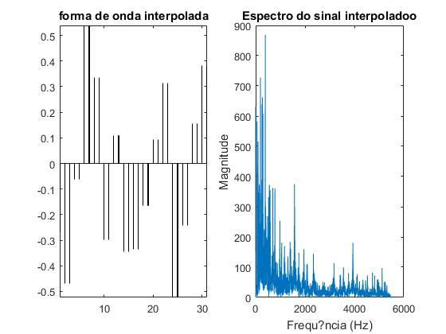
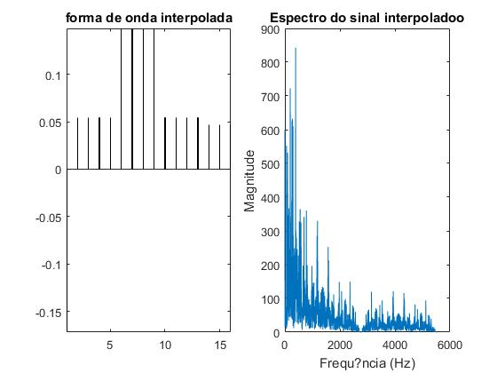
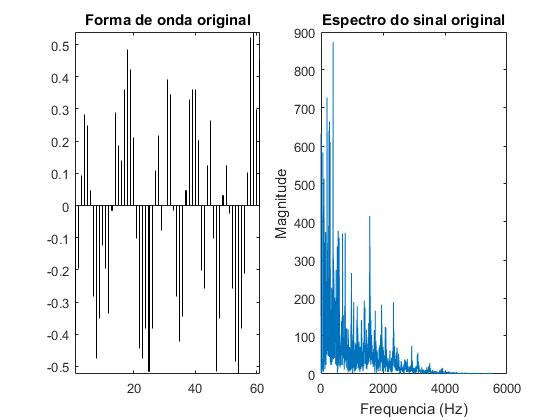
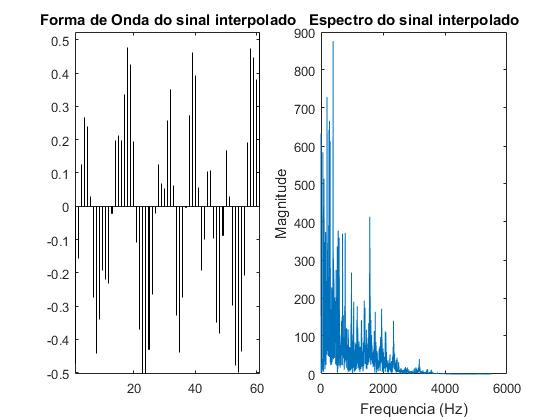
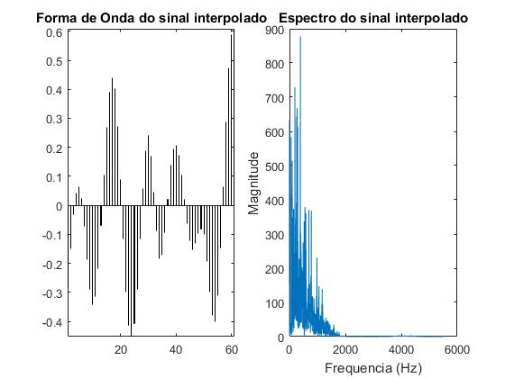
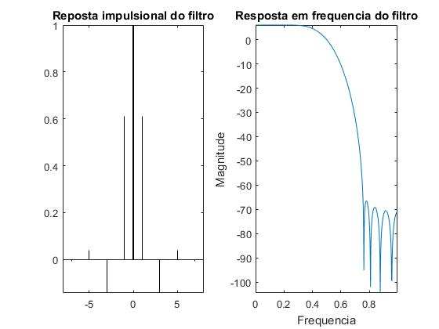
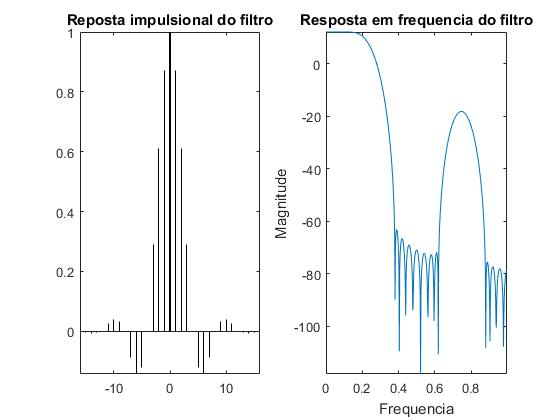
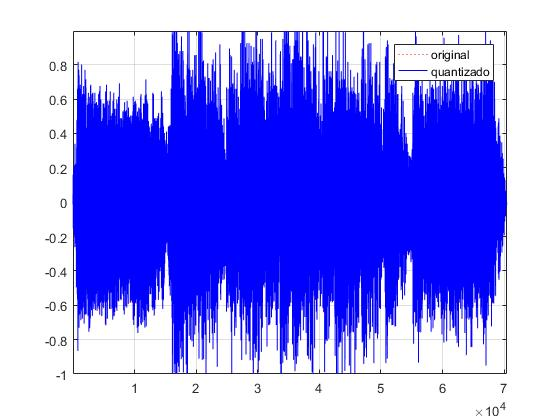
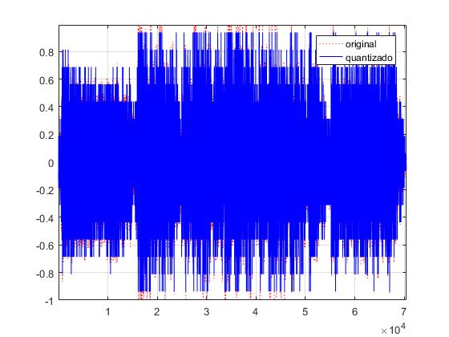

# Relatório do Lab 1: Amostragem e Quantização
```
Nome:   Gonçalo Ribeiro
Código: up201403977
Data:   28-02-2018
MNSE 2017/2018
```

## 1. Parte introdutória
Foi pedido para se escolher um ficheiro de música `mp3`
e o codificar duas vezes no formato `wav` com frequências de amostragem `44100 hz` e `11025 hz`. Verificou-se que a versão com a maior taxa de amostragem tem uma nitidez tangivelmente melhor do que a restante.

## 2. Variação da frequência de amostragem usando ou não filtros
Foi pedido que se realizassem sub amostragens com e sem filtro de um ficheiro de som.
Foi utilizado o ficheiro `batman_theme_x.wav`, fornecido no Moodle, com uma
taxa de amostragem de `11025 hz` e um número total de amostras de `70464`.
A escolha deste ficheiro residiu no facto de ser das únicas amostras disponíveis no Moodle que não provocavam erros na execução dos *scripts* fornecidos. Idealmente, tería que ser usado um ficheiro de som com, pelo menos, uma taxa de amostragem de `44100 hz` e, adicionalmente, frequências fora da banda de corte para se obterem resultados mais significativos nas sub amostragens com filtro.

Os *scripts* de *Matlab* `amostragemInterp_semFiltro.m` e `amostragemInterp_comFiltro.m` reduzem o número de amostras de um ficheiro de audio
por um fator fornecido, interpolando as restantes amostras de forma a
garantir que a sub amostragem tem o mesmo número de amostras que o ficheiro
original. Isto permite aos *scripts* calcular o **erro médio quadrático entre
o sinal original e a sub amostragem**. Seguidamente, os *scripts* também calculam
o ***Peak Signal to Noise Ratio* das sub amostragens** através do erro
previamente calculado. Na tabela seguinte reunem-se os resultados obtidos
nas **quatro** sub amostragens realizadas:

||Filtered|Unfiltered| 
|:-:|:-:|:-:|
|**k = 2**|`Erro = 0.000824002 PSNR = 30.7726`|`Erro = 0.00962606 PSNR = 20.0974`|
|**k = 4**|`Erro = 0.013163 PSNR = 18.7383`|`Erro = 0.0429577 PSNR = 13.6015`|
*Tabela 1: Erro médio quadrático e *PSNR* das diferentes sub amostragens.*

Analisando a tabela, verifica-se que as **sub amostragens com filtro têm menor erro e maior *PSNR* do que as sub amostragens sem filtro**, apresentando uma maior fidelidade à amostra original. Como se é de esperar, o mesmo também se pode dizer em relação às sub amostragens para metade *versus* as sub amostragens para um quarto.

### 2.1. Sub amostragens sem filtro

As seguintes imagens mostram a forma de onda e o espectro do sinal antes e depois das sub amostragens sem filtro:


*Figura 1 - Ficheiro original.*



*Figura 2 - Sub amostragem sem filtro para metade.*



*Figura 3 - Sub amostragem sem filtro para um quarto.*

É possível verificar a introdução de ***aliasing***  nas sub amostragens na forma de novos picos nos espectros de sinal - o espectro original é mais contido, afunilando progressivamente até aos `4000 hz` enquanto que os restantes espectros apresentam um perfil mais acidentado, com **novos** altos e baixos que se extendem para além dos `4000 hz`.

A qualidade de som perceptual da amostra original é praticamente identica à da sub amostragem para metade. No entanto, o mesmo não se pode dizer da sub amostragem para um quarto, que apresenta ruído e falta de nitidez.

### 2.2. Sub amostragens com filtro

As seguintes imagens mostram a forma de onda e o espectro do sinal antes e depois das sub amostragens com filtro:



*Figura 4 - Ficheiro original.*



*Figura 5 - Sub amostragem com filtro para metade.*



*Figura 6 - Sub amostragem com filtro para um quarto.*



*Figura 6 - Resposta do filtro da sub amostragem com filtro para metade.*



*Figura 7 - Resposta do filtro da sub amostragem com filtro para um quarto.*

A análise dos espectros de sinal e respsta em frequência de filtro permite-nos ver o limite máximo da **banda de corte** para cada sub amostragem: a sub amostragem para metade é cortada sensivelmente aos `3500 hz`, aproximando muito o espectro do ficheiro original; a sub amostragem para um quarto é cortada um pouco antes dos `2000 hz`. Pode-se dizer que a **banda de corte da sub amostragem para um quarto é restrita demais** porque cortou uma porção significativa do *high end* do ficheiro de som. Isto nota-se auditivamente devido à falta de *treble* no audio, tendo este ficado mais grave e menos perceptível.

A **grande diferença** auditiva entre as sub amostragens **com e sem filtro** é que, para a mesma taxa de amostragem, as sub amostragens com filtro conseguem atenuar alguma distorção  introduzida pela compressão (*aliasing*), notando-se **menos ruídos** estridentes em comparação às sub amostragens sem filtro.

## 3. Experiências de quantização

Foi pedido que se realizasse a quantização de um ficheiro de som para `256` e `16` valores. Estes valores representam o número de valores diferentes que uma amostra pode tomar. No caso de `256` valores, usam-se `8 bit` por amostra; no caso de `16` valores, usam-se `4 bit` por amostra.

Foi utilizado o ficheiro `batman_theme_x.wav`, fornecido no Moodle, com um *bit depth* de `8 bit`, ou seja, `65,536` valores possíveis por amostra. A escolha deste ficheiro residiu no facto de ser das únicas amostras disponíveis no Moodle que não provocavam erros na execução do *script* fornecido.

Para o efeito desta experiência, foi-nos disponibilizado o *script* de *Matlab* `quant_uniform.m` que automatomatiza a quantização e o posterior calculo do **erro quadrático médio** e o ***PSNR*** entre ficheiro original e as quantizações ralizadas. Na tabela seguinte reunem-se os resultados obtidos
nas **quatro** sub amostragens realizadas:

|||
|:-:|:-|
|**`8 bit`**|`Erro = 1.52588e-05 PSNR = 23.6994`|
|**`4 bit`**|`Erro = 0.00134515 PSNR = -7.7943`|
*Tabela 2 - Erro médio quadrático e *PSNR* das diferentes quantizações.*

Analisando a tabela, verifica-se que a que a quantização para `256` valores tem, praticamente, *erro médio quadrático nulo*. Isto deve-se ao facto de que a amostra original possui o mesmo *bit depth* de `8 bit`. Denote-se também que o *PSNR* da quantização para `4 bit` é negativo. Na teoria, isto significaria que o erro médio quadrático é **maior** que o quadrado do maior valor que uma amostra quantizada poderá tomar (`16` ao quadrado, `256`). Na pratica, é provável que seja um *bug* no *script* de *Matlab*.



*Figura 8: Espectro da quantização para `256` valores.*



*Figura 8: Espectro da quantização para `16` valores.*

Analisado os espectros anteriores, é possível verificar que a quantização para `256` valores não sofreu quaisquer alterações, como era de esperar. A quantização para `16` valores já revela algumas alterações no espectro, visíveis nas pontas dos diversos picos e também na discretização dos valores.

Qualitativamente, não há grande diferença de som entre as duas quantizações e o original.

Em suma, para se obterem resultados mais conclusivos, sería necessário usar um ficheiro de som original com pelo menos `16 bit` de *bit depth*.