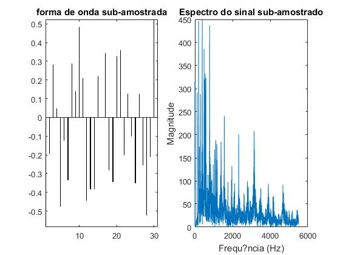
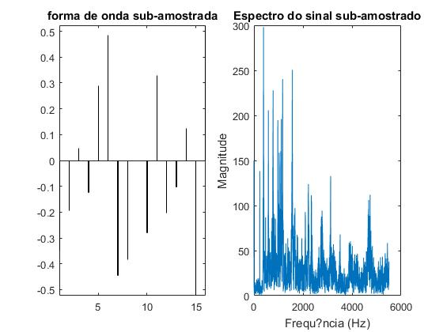
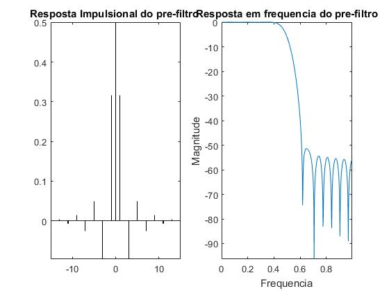
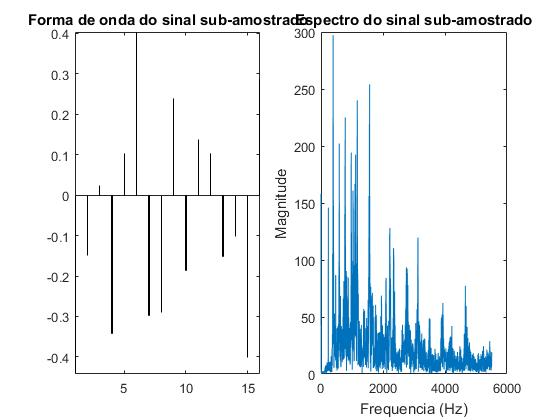
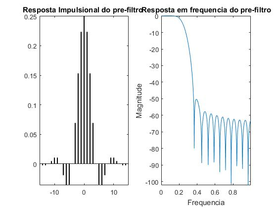
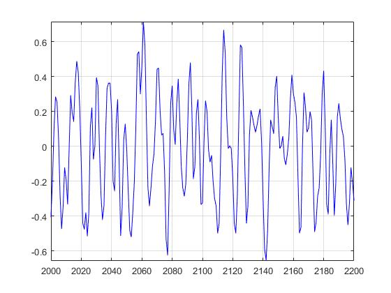
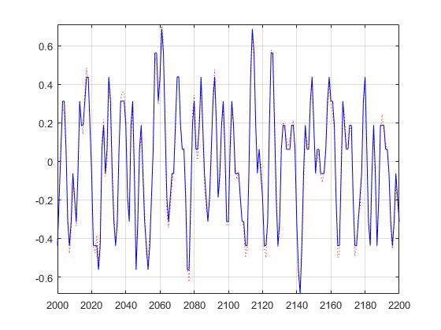

# Relatório de MNSE: Lab 1

## 1. Parte introdutória
Foi pedido para se escolher um ficheiro de música `mp3`
e o codificar duas vezes no formato `wav` com frequências de amostragem `44100hz` e `11025hz`. Verificou-se que a versão com a maior taxa de amostragem tem uma nitidez tangivelmente melhor do que a restante.

## 2. Variação da frequência de amostragem usando ou não filtros
Foi pedido que se realizassem sub amostragens com e sem filtro de um ficheiro de som.
Foi utilizado o ficheiro `batman_theme_x.wav` fornecido no Moodle com uma
taxa de amostragem de `11025hz` e um número total de amostras de `70464`.
Para este efeito, foram fornecidos os *scripts* de *Matlab*
`amostragemInterp_semFiltro.m` e `amostragemInterp_comFiltro.m`.

Estes *scripts* reduzem o número de amostras de um ficheiro de audio
por um fator fornecido, interpolando as restantes amostras de forma a
garantir que a sub amostragem tem o mesmo número de amostras que o ficheiro
original. Isto permite aos *scripts* calcular o **erro médio quadrático entre
o sinal original e a sub amostragem**. Seguidamente, os *scripts* também calculam
o ***Peak Signal to Noise Ratio* das sub amostragens** através do erro
previamente calculado. Na tabela seguinte reunem-se os resultados obtidos
nas **quatro** sub amostragens realizadas.

||Filtered|Unfiltered| 
|:-:|:-:|:-:|
|**k = 2**|`Erro = 0.000824002 PSNR = 30.7726`|`Erro = 0.00962606 PSNR = 20.0974`|
|**k = 4**|`Erro = 0.013163 PSNR = 18.7383`|`Erro = 0.0429577 PSNR = 13.6015`|

### 2.1. Sub amostragem para metade sem filtro

### 2.2. Sub amostragem para um quarto sem filtro

### 2.3. Sub amostragem para metade com filtro

### 2.4. Sub amostragem para um quarto com filtro

## 3. Experiências de quantização

### 3.1. Quantização para 8 bits por amostra

### 3.2. Quantização para 4 bits por amostra

