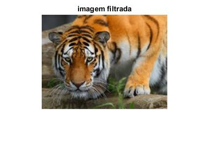

# Relatório do Lab 2: Fundamentos de processamento de sinais visuais
```
Nome:   Gonçalo Ribeiro
Código: up201403977
Data:   16-03-2018
MNSE 2017/2018
```
## 1. Espaços de Cor

Foi pedido que se desenvolvesse um script Matlab que:
1. Importe uma imagem com o formato bitmap (espaço de cores RGB) e apresente essa 
imagem no écran;
2. Separe cada componente RGB numa matriz diferente e apresente no écran cada uma 
delas;
3. Converta  essa  imagem  para  o  espaço  de  cores  HSV  e  apresente  essa  imagem  no 
écran;
4. Separe cada componente HSV numa matriz diferente e apresente no écran cada uma 
delas.

Este foi o script desenvolvido e utilizado para tais efeitos:

```matlab
function [] = lab2(in,out)

[~,name,ext] = fileparts(in);

% 1.1 i)
rgb = imread(in);
if size(rgb,3) ~= 3
rgb = cat(3,rgb,rgb,rgb)
end
figure(1),imshow(rgb),title('RGB');
imwrite(rgb,strcat(out,name,'-','rgb',ext));

% 1.1 ii)
r = rgb(:,:,1);
figure(2),imshow(r),title('Red');
imwrite(r,strcat(out,name,'-','r',ext));

g = rgb(:,:,2);
figure(3),imshow(g),title('Green');
imwrite(g,strcat(out,name,'-','g',ext));

b = rgb(:,:,3);
figure(4),imshow(b),title('Blue');
imwrite(b,strcat(out,name,'-','b',ext));

% 1.1 iii)
hsv = rgb2hsv(rgb);
figure(5),imshow(hsv),title('HSV');
imwrite(hsv,strcat(out,name,'-','hsv',ext));

% 1.1 iv)
h = hsv(:,:,1);
figure(6),imshow(h),title('Hue');
imwrite(h,strcat(out,name,'-','h',ext));

s = hsv(:,:,2);
figure(7),imshow(s),title('Saturation');
imwrite(s,strcat(out,name,'-','s',ext));

v = hsv(:,:,3);
figure(8),imshow(v),title('Value');
imwrite(v,strcat(out,name,'-','v',ext));
```

## 1.1. Conversão de RGB para HSV

No espaço de cor RGB, cada pixel é representado por 3 componentes correspondentes às intensidades das cores vermelha (Red), verde (Green) e azul (Blue) nesse pixel. As imagens utilizadas têm uma color depth de 24 bits, prefazendo 8 bits para cada uma das componentes. O modelo RGB é um modelo aditivo - a mistura das três cores base produz a cor branca, a sua ausência produz a cor preta.

A tabela seguinte apresenta as 5 imagens com espaço de cor RGB usadas nesta experiência, divididas nos seus componentes.

|RGB|Red|Green|Blue|
|:-:|:-:|:-:|:-:|
|||||
|||||
|||||
|||||
|||||

A primeira imagem representa um gradiente arco-íris horizontal. As componentes desta imagem são representadas por colunas verticais brilhantes sobre um fundo preto, localizadas em cima da zona correpondente à sua cor no arco-íris.

Como a segunda imagem é predominantemente vermelha, a componente vermelha é mais brilhante do que as restantes duas. O mesmo acontece com a imagem seguinte relativamente à componente verde.

Na próxima imagem, a componente azul é mais intensa no céu e no reflexo do céu na água. A componente vermelha manifesta-se mais nas escarpas no fundo da imagem. A componente verde está irmamente distribuida pela imagem.

A última imagem é a preto e branco. Por esse motivo, as componentes são todas iguais, "cancelando-se" umas às outras de forma a que nenhuma sobresaia.

O espaço de cor HSV representa cada pixel de uma imagem por 3 componentes: a tonalidade (Hue), a saturação (Hue) e o brilho (Value). 

A próxima tabela apresenta a transformação das imagens originais para um espaço de cor HSV, divididas nas suas componentes matiz (Hue), saturação (Saturation) e valor (Value).

Numa primeira vista, verifica-se que as cores foram "distorcidas" em comparação com as originais. Isto deve-se ao facto de se interpretarem imagens originalmente num espaço de cor RGB para um espaço de cor HSV - a componente Red passa a ser Hue, a componente Green passa a ser Saturation e a componente Blue passa a ser Value. Isto resulta nos seguintes efeitos observados:
* Na imagem das flores, as zonas vermelhas da imagem têm agora uma componente de tonalidade intensa.
* A imagem das folhas verdes é agora extremamente saturada.
* Na imagem da praia, o céu e o seu reflexo na água correspondem às zonas com a maior componente value da imagem.
* Na imagem do elefante, as componentes da tonalidade e satuação são agora nulas porque a imagem original era em preto e branco.

|HSV|Hue|Saturation|Value|
|:-:|:-:|:-:|:-:|
|||||
|||||
|||||
|||||
||||

## 1.2. Conversão de HSV para YCbCr

No espaço de cor YCbCr, cada pixel e representado por 3 canais correspondentes à luminancia (Y), cromancia azul (Cb) e cromancia vermela (Cr). A luminância representa o brilho do pixel, as cromâncias azul e vermelha representam as componentes azul e vermelha relativas à componente verde da imagem.

Este espaço de cor permite reduzir a redundância existente no modelo RGB, visto que o olho humano é mais sensível à componente Y do que às componentes Cb e Cr - é possível "poupar espaço" comprimindo as componentes das cromancias desde que se mantenha a precisão do canal de luminancia.

Foi adicionado este trecho de código ao script original de forma a se transformarem as imagem iniciais para o espaço de cor YCbCr, dividindo-as nas respectivas componentes.

```matlab
% 1.2
ycbcr = rgb2ycbcr(rgb);
figure(9),imshow(ycbcr),title('YCbCr');
imwrite(ycbcr,strcat(out,name,'-','ycbcr',ext));

y = ycbcr(:,:,1);
figure(10),imshow(y),title('Luma');
imwrite(y,strcat(out,name,'-','y',ext));

cb = ycbcr(:,:,2);
figure(11),imshow(cb),title('Blue Chroma');
imwrite(cb,strcat(out,name,'-','cb',ext));

cr = ycbcr(:,:,3);
figure(12),imshow(cr),title('Red Chroma');
imwrite(cr,strcat(out,name,'-','cr',ext));
```

A seguinte tabela apresenta os resultados obtidos:

|YCbCr|Luma|Blue Chroma|Red Chroma|
|:-:|:-:|:-:|:-:|
|||||
|||||
|||||
|||||
||||

Nas imagens produzidas, observa-se que as que as componentes de luminância possuem uma maior nitidez do que as de crominância. As primeiras são muito próximas do que seria uma imagem a preto e branco em espaço RGB, no entanto têm maior intensidades nas zonas verdes do que nas vermelhas ou azuis.

Este efeito é fácilmente observável na imagem das folhas verdes - as crominâncias possuem um valor muito baixo, enquanto que a crominância vermelha apresenta um valor ligeiramente elevado para as flores vermelhas, e a crominâncias azul para o céu na praia.

## 1.3. Comparanção com `rgb2yuv.m`

Foi pedido que se repetisse a experiência anterior mas agora com o script `rgb2yuv.m` e se comparassem os resultados obtidos.

O script `rgb2yuv.m` transforma uma imagem de input para o espaço de cor YUV, dividido nas suas respectivas componentes. Seguidamente, através deeste output, a imagem original é reconstituida.

YUV é um espaço de cor que funciona da mesma forma de YCbCr. No entanto usa coeficientes diferentes para a distribuição de cores, visto ser mais vocacionado para media analógico, enquanto que YCbCr é mais apropriado a media digital.

Foi possível observar que as imagens que YUV guardam menos informação nas componentes de crominância relativo às cores fora do azul e vermelho. No entanto, não há perda de informação - as imagens foram reconstruidas como esperado vist que os fundamentos do espaço de cor são iguais aos de YCbCr.

## 2. Variação  das  dimensões  espaciais  de  imagem  usando  ou  não  filtros  com imagem de teste “imzoneplate”

Foi pedido que se utilizasse o script ampliaReduz.m para vários tamanhos de imagem e para vários métodos de interpolação.

O script ampliaReduz.m cria uma imagem de teste com o tamanho especificado pelo primeiro parametro e amplia essa imagem de teste por um fator correspondente ao segundo parametro e utilizando um método de interpolação especificado pelo terceiro parametro.

Os métodos de interpolação utilizados são:
* Nearest Neighbour - a cor dos texels é igual à cor do pixel central do mesmo na imagem original;
* Bilinear - a cor dos texels é igual a uma média ponderada dos 4 pixeis que estão à volta do central;
* Bicubic - funciona da mesma forma que bilinear, mas utiliza os 16 pixeis mais próximos.

Na tabela seguinte, são apresentadas as experiências realizadas:

|Tamanho|Factor|Interpolação|
|:-:|:-:|:-:|
|256|2|Nearest|
|256|2|Bilinear|
|256|2|Bicubic|
|512|2|Nearest|
|512|2|Bilinear|
|512|2|Bicubic|
|512|0.5|Nearest|
|512|0.5|Bilinear|
|512|0.5|Bicubic|
|1024|0.5|Nearest|
|1024|0.5|Bilinear|
|1024|0.5|Bicubic|

**Observação:** As imagens dos resultados não foram apresentadas no relatório porque a conversão para .pdf retira o detalhe das imagens necessário para análise.

A imagem de teste consiste num conjunto de circulos concêntricos que vão ficando cada vez mais próximos e finos à medida que se afastam do centro.

Foi observado que qualquer redução produzia efeitos de aliasing no output - reduzir a imagem, quebra-se a frequência de Nyquist, levando ao aparecimento de padrões previamente não existentes. Este padrões revelam-se na forma de uma repetição simetrica de circulos concentricos à volta do centro da imagem.

O algoritmo nearest neighbour

A diferença entre a interpolação bilinear ou bicubic não é muito perceptvel em reduções, apenas existindo algumas diferenças nos padrões de aliasing. O mesmo não se pode dizer relativamente a ampliações - o algoritmo bicubic consegue suavizar linhas tangivelmente melhor o algoritmo bilinear.

<!--
x2 nearest = não se nota diferença entre imresize e repetição
x2 bilinear = por repetição é melhor, imresize torna-se em cinzento mais prox do centro
x2 bicubic = praticamente igual, centro dos circulos de aliasing é diferente

x.5 nearest = os circulos de aliasing têm so centros trocado (quando um é preto, o da outra imagem é branco e vice versa)
x.5 bilinear = imresize muito pior, torna-se em cinzento mais próximo do centro
x.5 bicubic = same as before
--> 

## 3. Experiências de filtragem

|Filter \ Magnitude|4|7|10|
|:-:|:-:|:-:|:-:|
|Movement||||
|Average||||
|Gaussian||||
|Prewitt Horizontal||||
|Prewitt Vertical||||

**Observação:** O filtro unsharp não foi utilizado porque o script dava erro.

O filtro movement cria uma sensação de movimento da imagem na direção horizontal. Este efeito é conseguido ao criar uma média com dimensão N dos píxeis presentes horizontalmente, conseguindo assim um efeito de "blur" linear nessa direção. Ao a imagem ser replicada horizontalmente, cria-se este efeito devido à semelhança ao efeito de persistência nos olhos humanos que resulta de movimentos reais.

Os filtros average e gaussian criam um efeito de desfoque na imagem, com objetivo de reduzir altas frequências. No entanto, utilizam algoritmos diferentes:
* Average utiliza a média dos pixeis à volta do pixel em questão para o efeito;
* Gaussian utiliza uma curva de Gauss para calcular a influência dos pixeis que rodeiam cada pixel da imagem original.
Pode-se confirmar que os efeitos do filtro Average são excessivos enquanto que o filtro Gaussian criou contornos mais suaves - facilmente observável nos bigodes do tigre - e eliminando mesmo assim altas frequências.

O objetivo do filtro  Prewitt é realçar contornos. Este efeito é conseguido calculando-se o gradiente da imagem usando uma matriz 3x3. Visto que o filtro Prewitt não realiza suavização, é muitas vezes difícil encontrar contornos em situações com altas frequências.
