# Relatório do Lab 3: Processamento de Imagem em Matlab

```text
Nome:   Gonçalo Ribeiro
Código: up201403977
Data:   01-04-2018
MNSE 2017/2018
```

## 1. Extração de um Fundo Azul

|RGB|Red|Green|Blue|
|:-:|:-:|:-:|:-:|
|||||
|||||
|||||

|Histogram|64|128|192|
|:-:|:-:|:-:|:-:|
|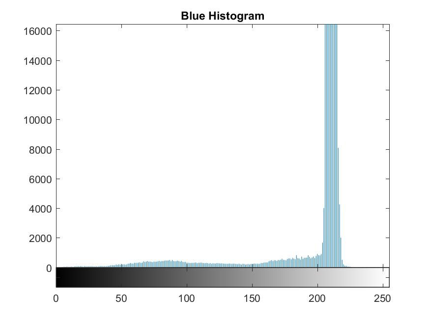|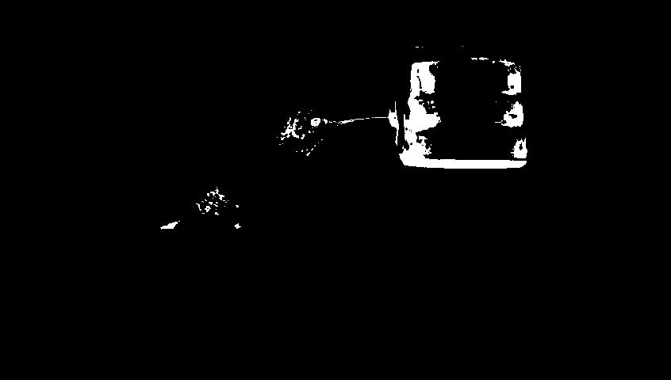|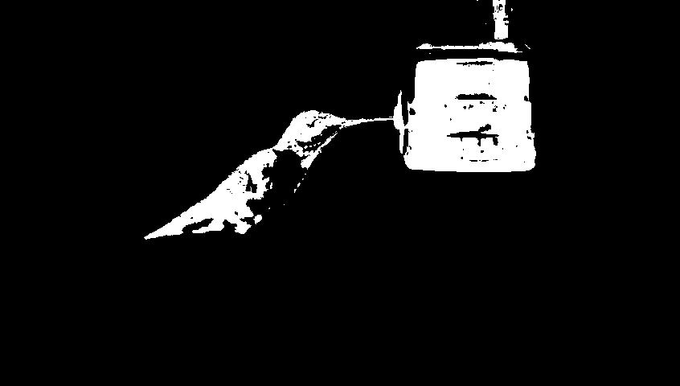|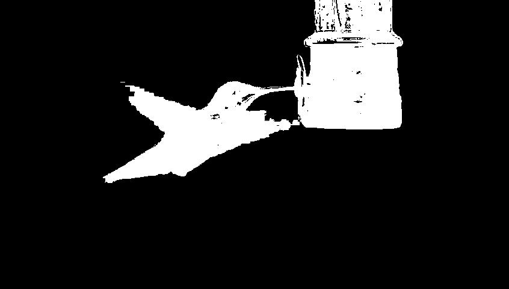|
|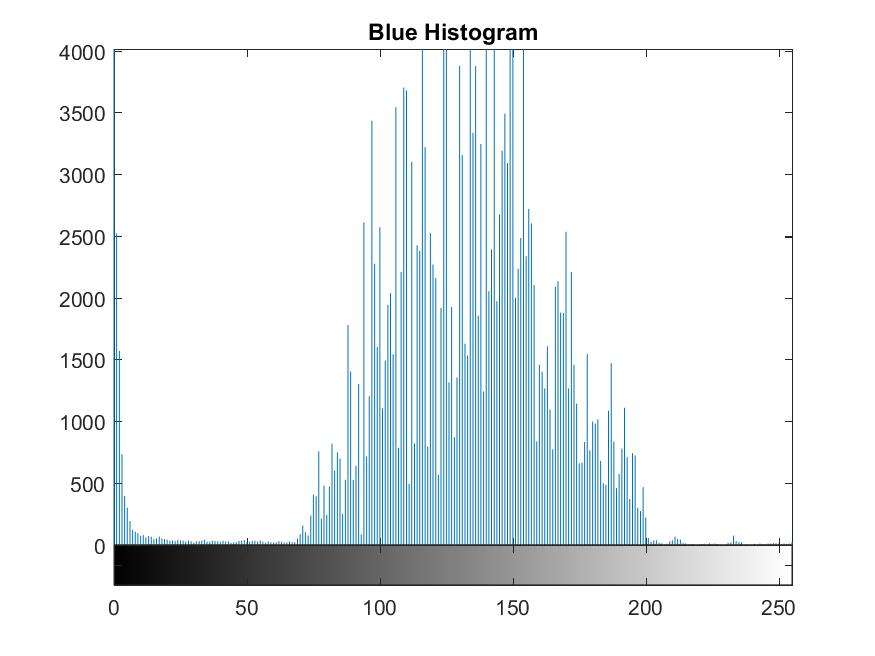|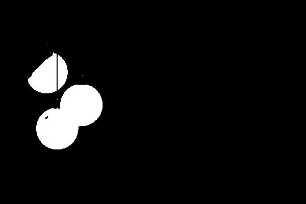|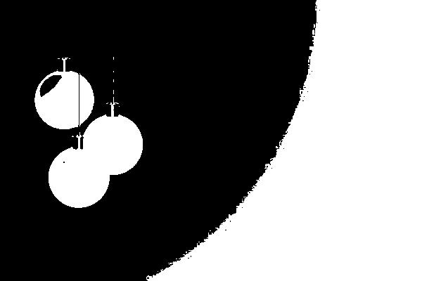|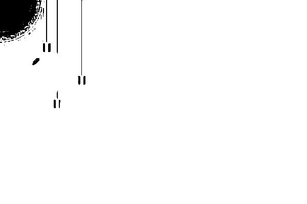|
|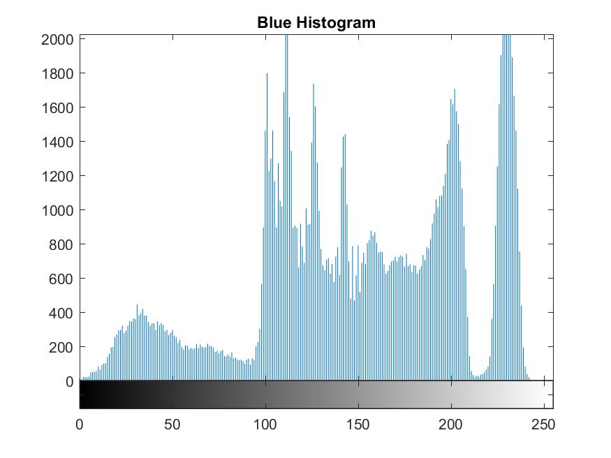|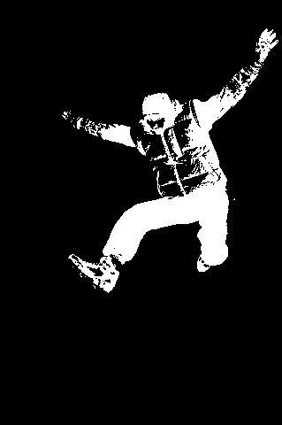||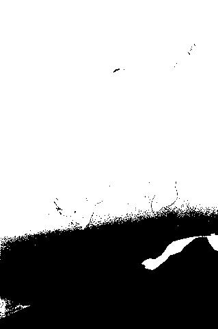|


## 1.1. Segmentação Básica

## 1.2. Segmentação Alternativa

## 2. Adição de Objetos a uma Imagem