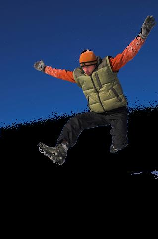
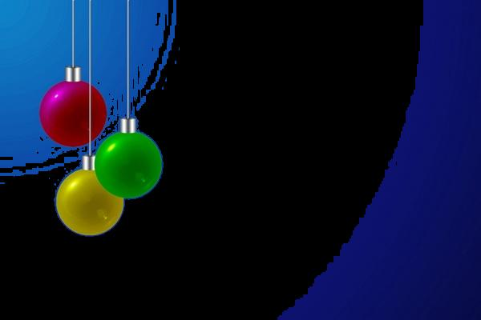
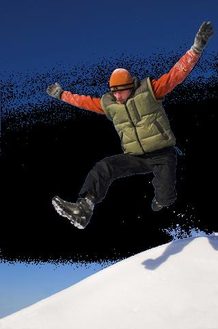

# Relatório do Lab 3: Processamento de Imagem em Matlab

```text
Nome:   Gonçalo Ribeiro
Código: up201403977
Data:   01-04-2018
MNSE 2017/2018
```

## 1. Extração de um Fundo Azul

## 1.1. Segmentação Básica

Foi pedido que se desenvolve-se um script *Matlab* que:

* Importe imagens com fundo azul e as apresente no ecrã;
* Separa cada um dos componentes RGB dessa imagem e os apresente no ecrã;
* Use a matriz da componente azul da imagem para distinguir objetos do fundo azul, apresentando um histograma dessa componente que permita o utilizador escolher um valor limite (de 0 a 255) a partir do qual é gerada uma máscara a preto e branco: a preto os pixeis com valores de componente azul superiores ao limite, a branco os que têm valores inferiores.

O script desenvolvido para o efeito foi o seguinte:

```matlab
function [] = lab3(in,out)

[~,name,ext] = fileparts(in);
rgb = imread(in);

if size(rgb,3) ~= 3
    rgb = cat(3,rgb,rgb,rgb);
end

figure(1),imshow(rgb),title('RGB');
imwrite(rgb,strcat(out,name,'-','rgb',ext));

r = rgb(:,:,1);
figure(2),imshow(r),title('Red');
imwrite(r,strcat(out,name,'-','r',ext));

g = rgb(:,:,2);
figure(3),imshow(g),title('Green');
imwrite(g,strcat(out,name,'-','g',ext));

b = rgb(:,:,3);
figure(4),imshow(b),title('Blue');
imwrite(b,strcat(out,name,'-','b',ext));

hist = figure(5);imhist(b),title('Blue Histogram');
saveas(hist,strcat(out,name,'-','hist_basic',ext));

thresholds = [32 64 96 128 160 192 224];

[h,w,~] = size(rgb);

for i = 1 : 7
    mask = zeros(h,w);
    threshold = thresholds(i);
    for j = 1 : h
        for k = 1 : w
            if b(j,k) < threshold
                mask(j,k) = 255;
            end
        end
    end
    figure(i+5),imshow(mask),title('Basic Segmenation');
    imwrite(mask,strcat(out,name,'-','basic_',num2str(threshold),ext));
end
```

Na seguinte tabela encontram-se as imagens utilizadas nos testes de segmentação e os seus respetivos componentes RGB:

|RGB|Red|Green|Blue|
|:-:|:-:|:-:|:-:|
|||||
|||||
|||||

É possível observar que não só as zonas azuis mas também zonas brancas (dorso do pássaro, reflexos nos efeitos natalícios, neve) têm uma componente azul mais intensa. Isto pode revelar-se como um problema na remoção do fundo azul por segmentação básica porque estas zonas brancas podem acabar por ser removidas erradamente.

Os resultados da segmentação simples são apresentados nas seguintes tabelas:

|birdBBjump.jpg|christmasBBjump.jpg|jump.jpg|
|:-:|:-:|:-:|
||||

|32|64|96|128|160|192|224|
|:-:|:-:|:-:|:-:|:-:|:-:|:-:|
||||||||
||||||||
||||||||

No primeiro histograma verifica-se que maior parte dos pixeis da imagem (céu) têm uma componente azul entre 195 e 220. Isto sugere um limite próximo de 195 como o mais indicado para se remover o fundo. Verifica-se que a máscara com o limite 192 é a que retém melhor os contornos do pássaro enquanto remove o fundo.

No segundo histograma verifica-se que a componente azul quase que segue uma distribuição normal entre 70 e 200. Um limite próximo de 70 seria o mais indicado para se remover o gradiente azul de fundo. Verifica-se que a máscara com limite 64 foi a que melhor removeu o fundo, preservando o formato das esferas.

No terceiro histograma verifica-se que a componente azul tem uma gama extensa de valores, sendo que existe um pico mais acentuado no histograma entre 225 e 240, correspondente ao céu azul. Visto isto, é difícil utilizar segmentação básica nesta imagem sem que se removam detalhes a mais - o que pode ser verificado no casaco do indivíduo a saltar nas máscaras com limites 64 e 96.

## 1.2. Segmentação Alternativa

Foi pedido que se alterasse o script anterior de forma a que, em vez de se comparar o limite escolhido com a componente azul da imagem, compará-se agora com a *blueness* do pixel, dada pela formula `blueness = blue - max(red,green)`.

Foi então adicionado o seguinte trecho de código ao script anterior:

```matlab
blueness = b;

for i = 1 : h
    for j = 1 : w
        blueness(i,j) = b(i,j) - max(r(i,j), g(i,j));
    end
end

hist = figure(13);imhist(blueness),title('Blueness Histogram');
saveas(hist,strcat(out,name,'-','hist_alt',ext));

for i = 1 : 7
    mask = zeros(h,w);
    threshold = thresholds(i);
    for j = 1 : h
        for k = 1 : w
            if blueness(j,k) < threshold
                mask(j,k) = 255;
            end
        end
    end
    figure(i+13),imshow(mask),title('Alternative Segmenation');
    imwrite(mask,strcat(out,name,'-','alt_',num2str(threshold),ext));
end
```

Os resultados da segmentação alternativa são apresentados nas seguintes tabelas:

|birdBBjump.jpg|christmasBBjump.jpg|jump.jpg|
|:-:|:-:|:-:|
||||

|32|64|96|128|160|192|224|
|:-:|:-:|:-:|:-:|:-:|:-:|:-:|
||||||||
||||||||
||||||||

Uma comparação dos histogramas por segmentação alternativa com os de segmentação simples permite concluir que os primeiros têm uma gama de frequências menor - por exemplo, enquanto que o histograma por segmentação simples do indivíduo a saltar tem uma gama que se extende dos 0 aos 255, o histograma da mesma imagem por segmentação alternativa apresenta uma gama dos 50 aos 70.

Isto facilita o isolamento do fundo azul porque pixeis que tenham uma grande componente azul sem serem azuis (como, por exemplo, pixeis brancos) expressam-se muito menos no histograma do que pixeis que tenham tons de azul.

Este efeito é observável na máscara com limite 64 dos efeitos natalícios, onde agora é possível ver o fio branco que com o método anterior era desprezado; ou então na máscara de limite 32 do indivíduo a saltar, onde os detalhes esbranquiçados do seu casaco já são incluídos.

## 2. Adição de Objetos a uma Imagem

O script original foi modificado da seguinte forma para agora fazer a superimposição das máscaras de segmentação com a imagem original:

```matlab
for i = 1 : 7
    threshold = thresholds(i);
    mask = zeros(h,w);
    for j = 1 : h
        for k = 1 : w
            if b(j,k) < threshold
                mask(j,k) = 255;
            end
        end
    end
    figure(i+6),imshow(mask),title('Basic Segmenation');
    imwrite(mask,strcat(out,name,'-','basic_',num2str(threshold),ext));
    mask = cat(3,mask,mask,mask);
    colored = rgb;
    colored(~mask) = 0;
    figure(i+13),imshow(colored),title('Superimposition');
    imwrite(colored,strcat(out,name,'-','basic_sup_',num2str(threshold),ext)); 
end

for i = 1 : 7
    mask = zeros(h,w);
    threshold = thresholds(i);
    for j = 1 : h
        for k = 1 : w
            if blueness(j,k) < threshold
                mask(j,k) = 255;
            end
        end
    end
    figure(i+20),imshow(mask),title('Alternative Segmenation');
    imwrite(mask,strcat(out,name,'-','alt_',num2str(threshold),ext));
    mask = cat(3,mask,mask,mask);
    colored = rgb;
    colored(~mask) = 0;
    figure(i+27),imshow(colored),title('Superimposition');
    imwrite(colored,strcat(out,name,'-','alt_sup_',num2str(threshold),ext));
end
```

## 2.1. Segmentação Básica

A seguinte tabela apresenta os resultado obtidos aplicando a máscara de segmentação básica nas imagens originais:

|32|64|96|128|160|192|224|
|:-:|:-:|:-:|:-:|:-:|:-:|:-:|
||||||||
||||||||
||||||||

## 2.2. Segmentação Alternativa

A seguinte tabela apresenta os resultado obtidos aplicando a máscara de segmentação alternativa nas imagens originais:

|32|64|96|128|160|192|224|
|:-:|:-:|:-:|:-:|:-:|:-:|:-:|
||||||||
||||||||
||||||||
